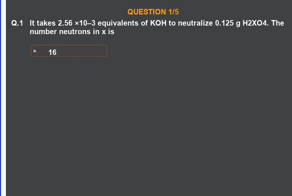

# Videorator
It creates videos automatically using json data dump. 
## Input JSON:
``` 
 {
          "que": {
            "1": {
              "q_option": [ "16", "8", "7", "32" ],
              "q_string": "It takes 2.56 \u00d710<sup>\u20133</sup> equivalents of KOH to neutralize 0.125 g H<sub>2</sub>XO<sub>4</sub>. The number neutrons in x is"
            }
          },
          "order_sign": [ 0, 0 ],
          "max_marks": 2,
          "qtmpl": 1,
          "qid": "9b7e579249a54fdfa6b0513b2d4b2ff5",
          "neg_marks": 1
        },
```

## Output Video:



### Tech-stack :- Amazon polly | Movie.py | PIL python library | FFMPEG.
A video automation tool that automates the whole process of video creation.
It works on JSON data dump from where it loads the initial data then animates the videos on the data using python movie.py and amazon Polly to produce sound. Then the MPEG library synchronizes the audio and animation to produce a video.
